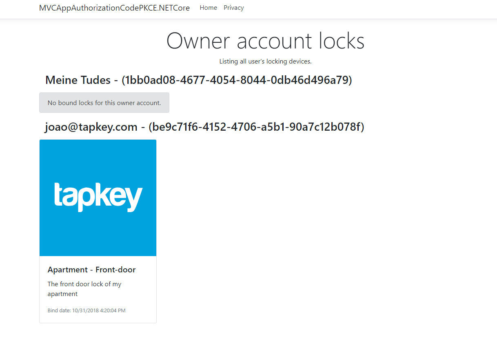

# Authorization Code with PKCE - "Native" ASP.NET Core MVC App

This application will display a list of all locking products bound to the user's Owner
Accounts.

## What is PKCE?
This sample project simulates having a native client accessing the Tapkey API by using the `authorization_code` flow with PKCE (Proof Key for Code Exchange) for mitigating the threat of having the authorization code intercepted.

Certain clients like native and mobile apps are vulnerable to attacks where another app can steal the `code` returned from the Authorization Server and use that in exchange for an `access_token` thus gaining full access of the user data.

You can read more about the Authorization Code flow with PKCE, what is the threat and how does it solves it in great detail here: [RFC 7636: Proof Key for Code Exchange](https://oauth.net/2/pkce/)

## Important

This is just a sample client that demonstrates step by step how the Authorization Code with PKCE flow works within a web app. The PKCE flow is intended for clients who cannot protect their secrets and also the redirect URIs. 

ASP.NET Core MVC apps are hosted in a domain you control and have server side code. In a real-world scenario, we would use secrets for such an application since it can be stored securely (for instance, you could store the secret as an environment variable in the server where the MVC app is hosted). The point of this sample is to just exemplify all the steps necessary to authenticate using this type of flow in a web application.

Also consider using libraries that are well know for handling OAuth/OpenId Connect flows instead of building it on your own. In the .NET community such well know packages are the ones part of the Identity Server "ecosystem". [IdentityModel](https://github.com/IdentityModel/IdentityModel2), [IdentityModel.OidcClient2](https://github.com/IdentityModel/IdentityModel.OidcClient2) and for more general info see here: [IdentityServer](https://identityserver.io/)


## Prerequisites
You need to register your client application in the Tapkey portal here: [Manage your OAuth clients](https://my.tapkey.com/AdminUI/#/oauth-clients). 

For that **make sure you**:

1. Select the `Authorization Code` flow with support for `PKCE`
2. Use this URI for the "Redirect URIs" field: `http://localhost:55183/Auth/LoginCallback`
3. Use this URI for the "Allow CORS origins" field: `http://localhost:55183`
4. Select both the `CoreEntities` and `Owners` permission with at least "ReadOnly"

After creating your client, copy the `ClientId` generated for you. We'll use it in the next step.

## Configuring the App

ASP.NET Core apps have an `appsettings.json` file where all the configuration is stored. You will find in the `appsettings.json` in this app a section called `AppConfiguration`. Open the settings file and paste the ClientId you got in the previous step. It should look like this:

```
  "AppConfiguration": {
    "ClientId": "< PASTE YOUR CLIENT ID HERE >",
    "TapkeyApiBaseUrl": "https://my.tapkey.com/",
    "TapkeyAuthorizationServerUrl": "https://login.tapkey.com/",
    "TapkeyAuthorizationEndpointPath": "connect/authorize",
    "TapkeyTokenEndpointPath": "connect/token"
  }
```
That's it! The app should be good to go.

## Technology used
* ASP.NET Core 2.2.0
* [IdentityModel][1] (We use the Crypto helper class/methods that generates the PKCE values)

## Usage
You can run the app by either:

- Opening and starting it within Visual Studio 2017
- Run it from the command line. Just navigate to root directory and run `dotnet run`

The app will run on `http://localhost:55183/`

## Example output
Upon successfull authentication, a similar page should be displayed. (Depends if there are any owner accounts and locking devices.)



## Structure
There's two "places" where the main logic happens. `AuthController` and `OwnerLocksController`

### AuthController

#### Login action
When clicking on the "Click here to start" button in the startup page, you are redirected to the action `Login` inside `AuthController`.

At the beginning of the method, we generate the `CodeVerifier` and `CodeChallenge` by following the [RFC7636](https://tools.ietf.org/html/rfc7636). We used the NuGet package [IdentityModel](https://github.com/IdentityModel/IdentityModel2) to make life a little easier. These are then stored **in memory** to be used later on when requesting the `access_token`.

We then construct the URL with all the parameters necessary for the authorization with the Tapkey Authorization server (between lines `58` and `71`) and issue a `Redirect` to the Tapkey Authorization Server.

#### LoginCallback action
Once the user is logged in and gave his consent, the Tapkey Authorization Server will use the `redirect_uri` provided later and redirects the user to the `LoginCallback` action with the `code` in the query string.

In the possession of the `code` we now proceed to call the `token` endpoint where we will exchange the `code` with an `access_token` which we can use to talk with the Tapkey API.

The code is similar. We construct now a `POST` request. Since we are doing an `authorization_code with PKCE` flow, we also retrieve the `CodeVerifier` from the cache. This is crucial because it's used by the Authorization Server to prevent the code interception attack. We issue the request and if all is well, we get back an `access_token`.

We set the `access_token` into the memory cache and redirect the user to the next page. 

> In a real-world app scenario consider using another approach for storing the `access_token`. 

### OwnerLocksController

We are then redirected to the `Index` inside the `OwnerLocksController`. There we will do the following:

1. Retrieve the `access_token` from the cache
2. Retrieve Owner Accounts for the present user, and iterate over them
3. Retrieve Bound Locks for the current Owner Account
4. Displays the information

# License
Copyright (c) Tapkey GmbH. All rights reserved.

Licensed under the [Apache License 2.0](https://spdx.org/licenses/Apache-2.0.html)

[1]: https://github.com/IdentityModel/IdentityModel2
